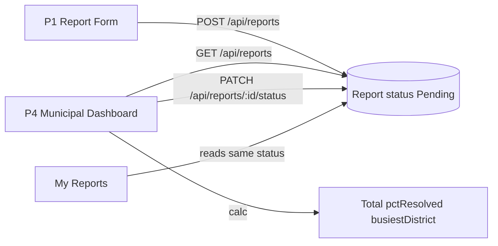

# P4 Municipal Dashboard Plan

## Locked decisions
- **Full stack:** P4 owns backend status update + dashboard UI (stats calculated from report list or a small stats helper).
- **Resolve merge conflicts** first so the app builds; keep **report/auth from HEAD** (`AuthContext`, `ReportPage`, `MyReports`) and add **`municipality` role** from the vipooshan `User` model where it does not break existing citizen auth.
- **MVP = team table only:** Total Reports, % Resolved, Busiest District, mark Acknowledged/Resolved. No crew assignment, route optimization, or SMS.

## Architecture

## 1. Unblock the repo (merge conflicts)

Resolve `<<<<<<<` markers in at least:
- [client/src/App.jsx](client/src/App.jsx), [client/src/services/api.js](client/src/services/api.js), [client/src/components/Header.jsx](client/src/components/Header.jsx), [client/src/pages/Home.jsx](client/src/pages/Home.jsx)
- [server/server.js](server/server.js), [server/models/User.js](server/models/User.js), [server/config/db.js](server/config/db.js), [server/package.json](server/package.json)

**Auth merge rule:** Keep HEAD’s `AuthContext` + `/auth/register|login|profile` flow used by Report/My Reports. Ensure `User` schema includes optional `role` enum `citizen | municipality | recyler` (default `citizen`). JWT/`protect` should expose `role` on `req.user` (load from DB or put `role` in token).

## 2. Backend: Calculate + Update

**Files:** [server/controllers/report/reportController.js](server/controllers/report/reportController.js), [server/routes/report/reportRoutes.js](server/routes/report/reportRoutes.js), [server/middleware/auth.js](server/middleware/auth.js)

Add:
- `PATCH /api/reports/:id/status` — body `{ status: "Acknowledged" | "Resolved" }` (also allow `"Pending"` only if needed for corrections; default transitions: Pending → Acknowledged → Resolved). Validate against Report schema enum. Prefer `protect` + role check `municipality` (fallback for demo: any authenticated user if role wiring is incomplete after merge — prefer real role gate).
- Reuse existing `GET /api/reports` for the live list.

Stats: compute on the **client** from the full list (no new endpoint required for MVP):
- `total = reports.length`
- `resolvedPercent = round(100 * resolved / total)` (0 if empty)
- `busiestDistrict = mode of district` (tie-break: first alphabetically)

## 3. Client API

**File:** [client/src/services/reportService.js](client/src/services/reportService.js) (+ ensure [api.js](client/src/services/api.js) has `patch`)

- `updateReportStatus(id, status, token)` → `PATCH /reports/:id/status`

## 4. Dashboard UI

Replace `/dashboard` placeholder in [App.jsx](client/src/App.jsx) with a new page, e.g. [client/src/pages/MunicipalDashboardPage.jsx](client/src/pages/MunicipalDashboardPage.jsx).

**Layout (match existing `interior-page` / badge CSS from My Reports):**
1. Metric row: Total Reports | % Resolved | Busiest District
2. Report list (reuse card patterns from [MyReportsPage.jsx](client/src/pages/MyReportsPage.jsx)): district, waste type, description, date, status badge, optional image thumbs via relative `/uploads/...`
3. Per-report actions: **Acknowledge** (if Pending), **Resolve** (if not Resolved); disable/hide when already in that state; optimistic or refetch after success

**Access:** Gate with `useAuth` — redirect unauthenticated users to `/login`. Prefer `user.role === "municipality"`; if login response does not yet return role after merge, allow any logged-in user temporarily and document registering with Municipality role.

**Nav:** Ensure Header/Home link to `/dashboard` works after conflict resolution.

## 5. Styling

Extend [client/src/index.css](client/src/index.css) with dashboard-specific classes (metric strip, action buttons) using existing CSS variables — no new UI library.

## 6. Manual check

- Submit a report via `/report` → appears on dashboard as Pending
- Acknowledge → status updates; citizen My Reports shows Acknowledged
- Resolve → % Resolved and Busiest District update correctly
- Empty DB: metrics show 0 / 0% / “—” without crashing

## Out of scope
Map view, crew assignment, route optimization, filters beyond what’s needed for the three metrics, seed script (optional later).
